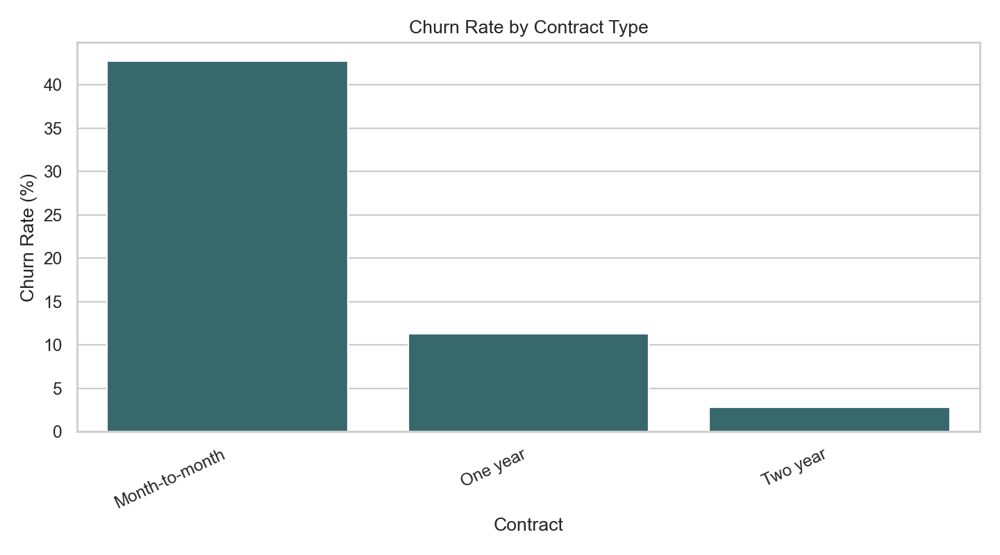
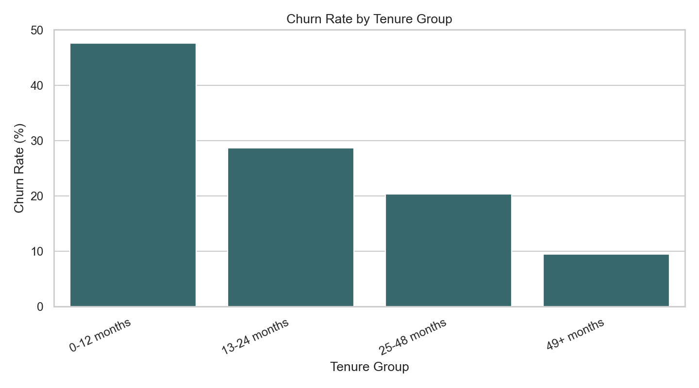
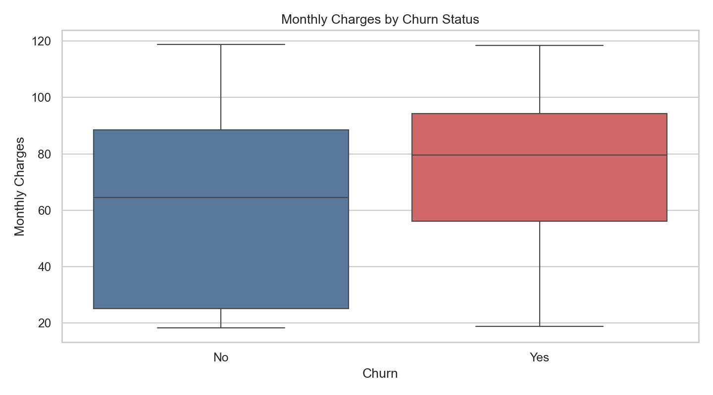
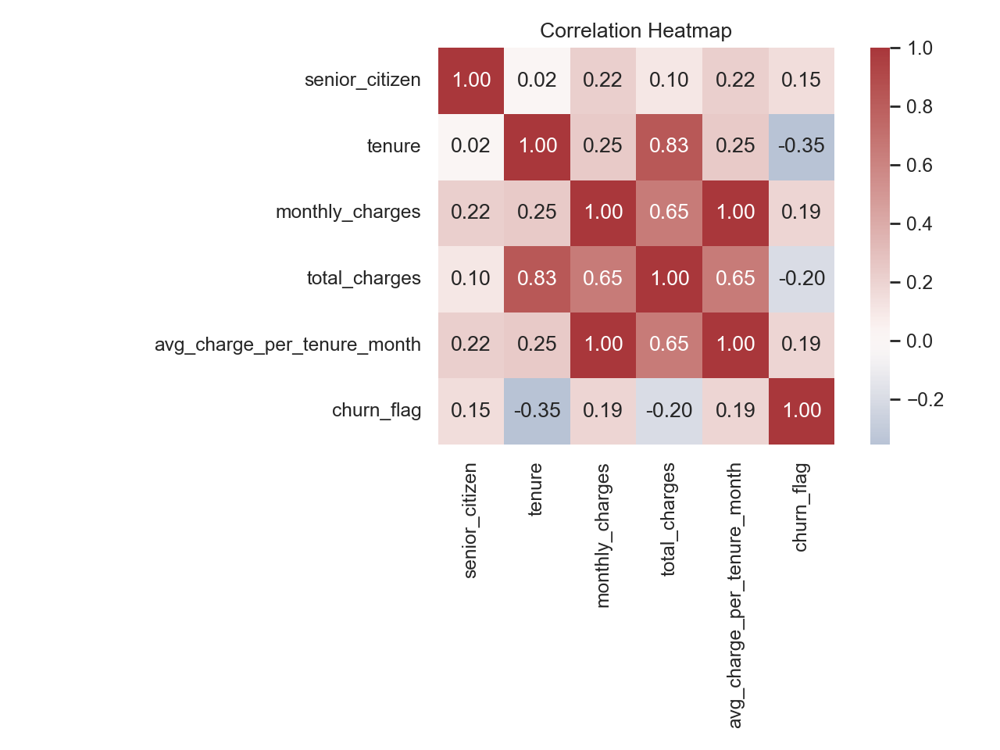

# 📊 Customer Churn Analysis (SQL + Python + Machine Learning)

An end-to-end analytics project that identifies **why telecom customers churn and how to reduce churn risk** using the IBM Telco Customer Churn dataset.

This project demonstrates real-world data analytics skills including:
- SQL data cleaning & transformation
- Exploratory Data Analysis (EDA) in Python
- Data visualization & storytelling
- Business insights & recommendations
- Optional predictive modeling

---

## 🎯 Business Problem

Customer churn directly impacts revenue and profitability. The goal of this analysis is to understand:

- Why customers leave
- Which customers are most likely to churn
- What behavioral and contract factors drive churn
- What business actions can improve retention

---

## ❓ Key Business Questions

- What are the strongest predictors of churn?
- Which customer segments are at highest risk?
- How do contract types affect churn rates?
- Does tenure influence customer retention?
- How do pricing and services impact churn?

---

## 📂 Dataset

IBM Telco Customer Churn Dataset  
https://www.kaggle.com/datasets/blastchar/telco-customer-churn

---

## 📊 Key Insights (Replace with your results)

- Month-to-month customers have the highest churn rate (~X%)
- Customers with low tenure (<12 months) are significantly more likely to churn
- Electronic check payment users show higher churn risk
- Customers with add-on services (tech support, security) are less likely to churn

---

## 📈 Visualizations

> These charts are generated from Python (matplotlib / seaborn)

### 📉 Churn by Contract Type


### 📉 Churn by Tenure


### 💰 Monthly Charges vs Churn


### 🔥 Correlation Heatmap


---

## 🤖 Predictive Modeling (Logistic Regression Baseline)

A baseline Logistic Regression model was trained to predict customer churn using:

- One-hot encoded categorical variables  
- Standardized numeric features  
- Balanced class weights to handle class imbalance  
---

### 📊 Model Performance

- **ROC AUC Score:** 0.839  
- **Accuracy:** 0.73  

---

### 📉 Classification Report

```text
              precision    recall  f1-score   support

    Retained       0.91      0.71      0.80      1291
     Churned       0.50      0.80      0.62       467

    accuracy                           0.73      1758
   macro avg       0.70      0.76      0.71      1758
weighted avg       0.80      0.73      0.75      1758

## 🧠 Methods Used

### SQL (Data Engineering)
- Data cleaning & preprocessing
- Feature engineering (tenure groups, churn flags)
- Aggregations and cohort analysis

### Python (Data Analysis)
- pandas, NumPy for data manipulation
- seaborn, matplotlib for visualization
- exploratory data analysis (EDA)
- optional logistic regression model

---

## 🏗 Project Structure

customer-churn-analysis/
├── data/
│   ├── raw/
│   └── processed/
├── sql/
│   ├── schema.sql
│   ├── data_cleaning.sql
│   └── business_queries.sql
├── notebooks/
│   └── churn_analysis.ipynb
├── src/
│   ├── data_cleaning.py
│   ├── analysis.py
│   └── modeling.py
├── visualizations/
├── reports/
├── README.md
├── requirements.txt
└── .gitignore
---
